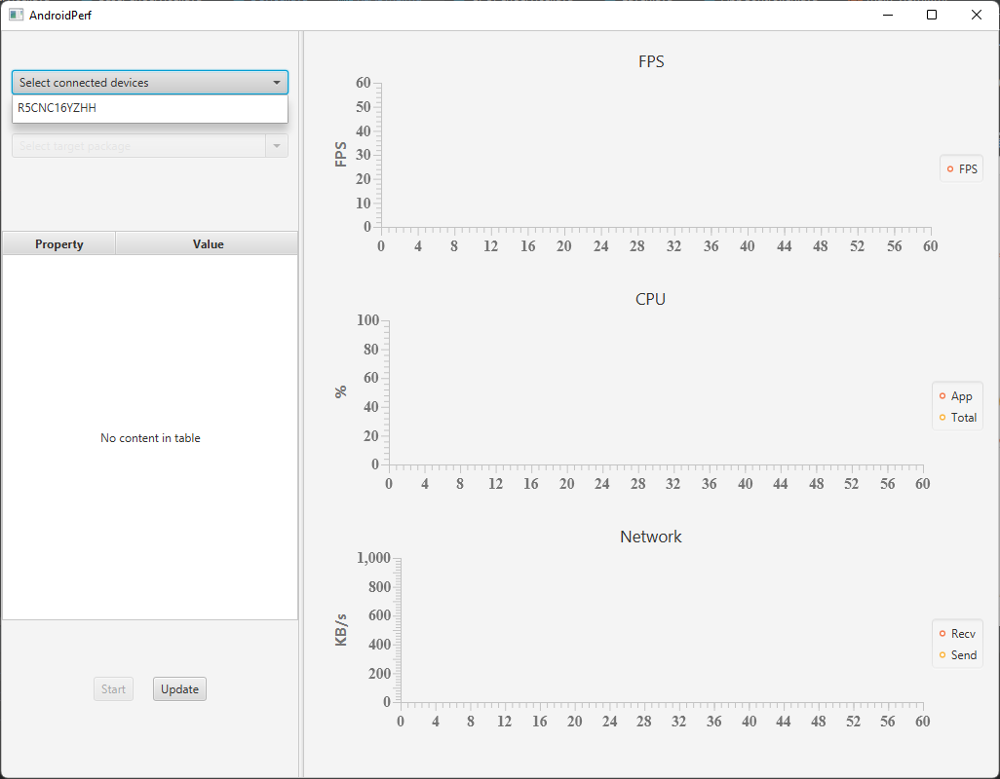
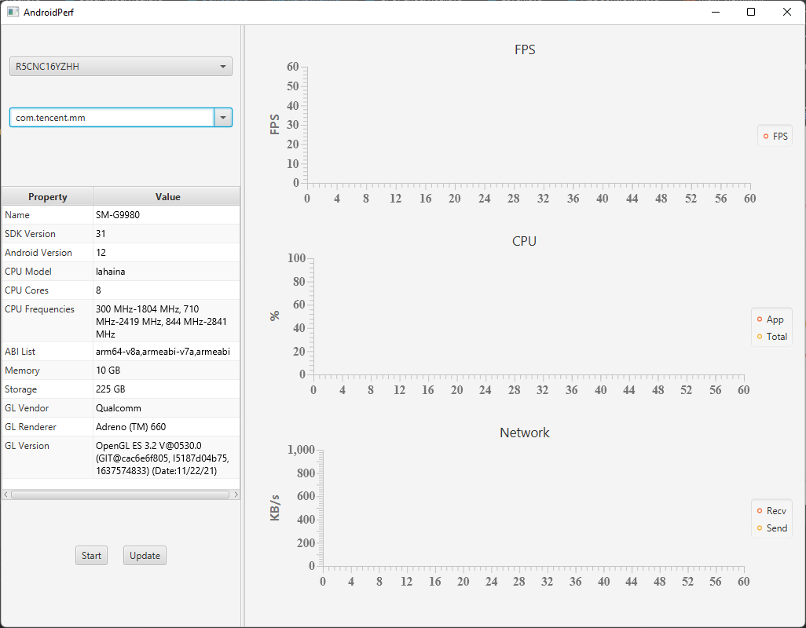

## 下载
下载链接为：https://cloud.tsinghua.edu.cn/f/1667d37b904348c48e63/

## 使用

1. 保证系统启动了ADB server。可以输入adb start-server命令来启动。
2. 双击AndroidPerf.exe使用，目前提供的版本为Windows版，不过程序本身是跨平台的，只是仅打包了Windows的二进制，需要的话可以再打包macOS或者Linux的版本。
3. 如下图所示，首先选择你的设备。
    
4. 其次选择要测量的应用的包名。下拉列表中最顶上的包名对应的是当前正在运行的应用以方便选择。
    
5. 点击下方的Start开始测量。
6. 如果有新的设备接入或者新的应用安装，点击Update按钮来更新两个列表。

## 测试
1. 目前测试的应用主要有B站、腾讯视频、优酷视频、Chrome浏览器、YouTube等视频应用，狂野飙车、原神等游戏应用，以及若干普通应用。
2. 测试所用的机型包括Pixel XL、Pixel 3 XL、Pixel 3a、Samsung Galaxy S20 Ultra、荣耀和小米的若干机型。
3. 测试的Android版本包括7.1、8、9、10、11、12
4. 测试的视频应用的特殊场景包括：视频切换、全屏切换、弹幕开关、悬浮窗播放、分屏播放、应用切换、直播。
